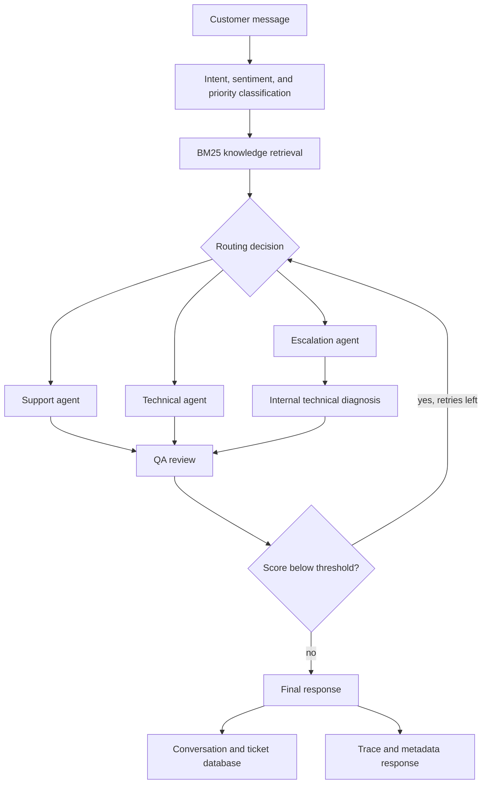

<h1 align="center">Multi-Agent Customer Support</h1>

<p align="center">
  <strong>An AI customer support workflow for intent routing, knowledge retrieval, escalation, QA review, and ticket persistence.</strong>
  <br />
  <em>Support automation · RAG knowledge base · QA retry loop · FastAPI ticket system</em>
</p>

<p align="center">
  <a href="README.md">English</a> ·
  <a href="README.zh-CN.md">简体中文</a>
</p>

<p align="center">
  
  
  
  
</p>

---

Multi-Agent Customer Support is an AI support system for SaaS products, API platforms, internal tools, and online services. A customer message is classified, matched with relevant FAQ knowledge, routed to the right support role, reviewed by a QA step, and stored with conversation and ticket metadata.

The agent workflow is implemented with LangGraph's `StateGraph`, so routing, retries, and execution traces are explicit in code instead of hidden inside a sequential agent chain.

## Application Scenario

This project models the common customer support flow used in real products:

1. A user asks a question or files a complaint.
2. The system classifies the intent, sentiment, and effective priority.
3. A BM25 retriever searches the local support knowledge base.
4. The message is routed to a support, technical, or escalation agent.
5. A QA step scores the response and sends it back for revision when it is below threshold.
6. The final response, agent path, intent, sentiment, QA score, and ticket state are persisted.

The goal is to make the support workflow easy to inspect and modify: routing logic is isolated, the knowledge retriever is replaceable, and the API returns enough metadata to debug each request.

## Core Features

| Feature | Description |
| --- | --- |
| Intent-aware routing | Classifies messages into general, technical, billing, or complaint scenarios and routes them to the proper support role. |
| Support knowledge retrieval | Uses a local BM25 FAQ retriever before answer generation to reduce unsupported responses. |
| Role-based support handling | Separates first-line support, technical troubleshooting, escalation coordination, and QA review. |
| QA retry loop | Scores each draft response for accuracy, completeness, empathy, and actionability; low-score responses return to the original agent with feedback. |
| Ticket and conversation persistence | Stores user messages, assistant replies, assigned agent, intent, sentiment, and QA score through SQLAlchemy. |
| Observable execution trace | API responses include the agent path and workflow metadata for debugging and UI visualization. |

## Architecture



## Quick Start

### Install

```bash
python3 -m venv .venv
source .venv/bin/activate
python -m pip install --upgrade pip
python -m pip install -r requirements.txt
```

### Configure the LLM

Copy the environment template and set an OpenAI-compatible API key. The default provider configuration uses DeepSeek; Qwen, Kimi, OpenAI, and other compatible endpoints can be used by changing the base URL and model name.

```bash
cp .env.example .env
```

Edit `.env`:

```text
LLM_API_KEY=your_api_key_here
LLM_BASE_URL=https://api.deepseek.com
LLM_MODEL=deepseek-chat
```

Never commit your real `.env` file or API key.

### Run the CLI Demo

```bash
python demo.py "My API keeps returning 401 errors. What should I check?"
```

### Run the Web Service

```bash
python main.py
```

Open:

```text
http://localhost:8000/chat
```

The chat page sends requests to the FastAPI backend and displays the response plus the execution trace.

## API Usage

### Send a Support Message

```bash
curl -X POST "http://localhost:8000/api/support/message" \
  -H "Content-Type: application/json" \
  -d '{
    "customer_id": "customer_001",
    "message": "The API keeps returning 401 Unauthorized.",
    "priority": "medium"
  }'
```

The response contains:

```json
{
  "conversation_id": 1,
  "response": "...",
  "agent": "technical_agent",
  "agents_used": ["technical_agent", "qa_agent"],
  "metadata": {
    "intent": "technical",
    "sentiment": "neutral",
    "effective_priority": "medium",
    "qa_score": 8.5,
    "retry_count": 0,
    "retrieved_docs": ["API调用返回401错误"]
  },
  "trace": ["[intake] ...", "[classify_intent] ..."]
}
```

### Create a Ticket and Start a Conversation

```bash
curl -X POST "http://localhost:8000/api/support/ticket" \
  -H "Content-Type: application/json" \
  -d '{
    "customer_id": "customer_001",
    "subject": "API authentication failure",
    "description": "Our production API calls started returning 401.",
    "priority": "high"
  }'
```

## Knowledge Base

The example support knowledge base lives in `backend/rag/knowledge_base.json`. It currently contains FAQ-style support entries covering account access, API errors, installation issues, billing, refunds, export, synchronization, and device limits.

The default retriever is BM25 with Chinese tokenization through `jieba` when available. `VectorRetriever` is left as an extension point for FAISS or embedding-based retrieval.

## Project Structure

```text
backend/
  api/
    main.py                 # FastAPI endpoints
  graph/
    state.py                # Shared workflow state and trace reducer
    nodes.py                # Classification, RAG, support roles, QA, finalize
    routing.py              # Conditional routing and retry decisions
    builder.py              # StateGraph construction
  llm/
    client.py               # OpenAI-compatible ChatOpenAI client
  rag/
    knowledge_base.json     # Example support FAQ corpus
    retriever.py            # BM25 retriever and vector retriever interface
  models/                   # Pydantic and SQLAlchemy models
  services/                 # Support, ticket, and conversation services
frontend/
  templates/
    chat.html               # Web chat UI and trace display
demo.py                     # CLI demo
main.py                     # Uvicorn entry point
requirements.txt
tests/
  test_routing_and_rag.py   # Routing and BM25 tests
```

## Validation

Run lightweight checks:

```bash
python3 -m compileall -q .
pytest tests/ -v
```

`pytest tests/ -v` does not require an API key because it covers deterministic routing and BM25 retrieval logic. Full CLI or web workflow execution requires a configured LLM API key.

## Notes

- The project is a reproducible customer support automation demo, not a hosted production service.
- The default database is local SQLite: `customer_support.db`.
- Generated database files, `.env`, caches, and virtual environments should stay out of Git.
- The included FAQ corpus is example support content; replace it with your own product documentation for real usage.

## Upstream

This project is adapted from an open-source CrewAI customer support example and restructures the support flow as an explicit graph-based workflow.

## License

MIT License. See [LICENSE](LICENSE).
