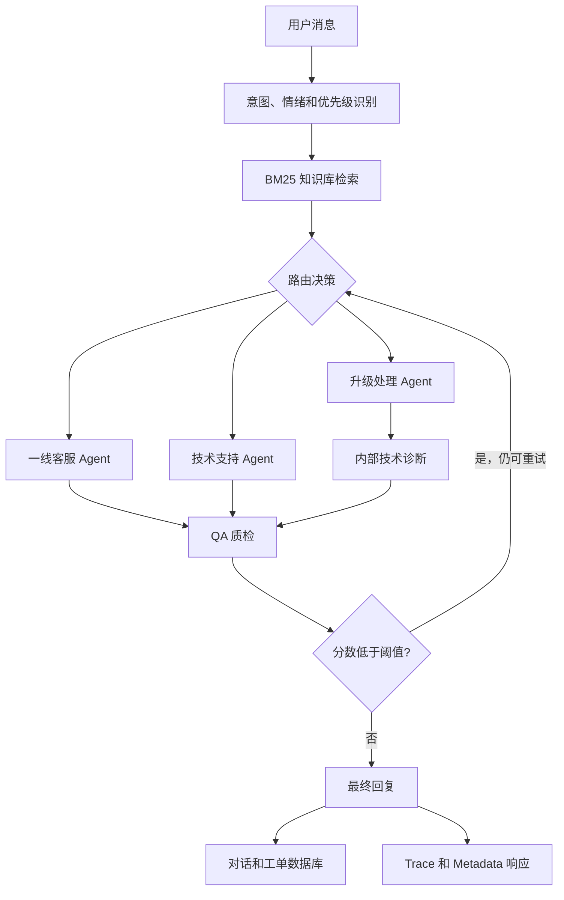

<h1 align="center">Multi-Agent Customer Support</h1>

<p align="center">
  <strong>面向客服场景的 AI 工作流系统，覆盖意图分流、知识库检索、投诉升级、QA 质检和工单沉淀。</strong>
  <br />
  <em>客服自动化 · RAG 知识库 · QA 重试循环 · FastAPI 工单系统</em>
</p>

<p align="center">
  <a href="README.md">English</a> ·
  <a href="README.zh-CN.md">简体中文</a>
</p>

<p align="center">
  
  
  
  
</p>

---

Multi-Agent Customer Support 是一个面向 SaaS、API 平台、企业内部系统和在线服务的智能客服系统。用户提交问题后，系统会完成意图识别、知识库检索、角色分流、QA 质检，并将对话和工单元数据持久化。

项目的 Agent 工作流使用 LangGraph 的 `StateGraph` 实现，因此路由、重试和执行轨迹都在代码中显式可见，而不是隐藏在顺序式 Agent 链路里。

## 应用场景

这个项目模拟真实产品中的客服处理流程：

1. 用户提交普通咨询、技术问题、账单问题或投诉。
2. 系统识别问题意图、客户情绪和生效优先级。
3. BM25 检索器从本地 FAQ 知识库中召回相关支持文档。
4. 消息被分配给一线客服、技术支持或升级处理 Agent。
5. QA 节点评估回复质量，低于阈值时带着质检意见回到原 Agent 重新生成。
6. 最终回复、Agent 路径、意图、情绪、QA 分数和工单状态被保存。

项目目标是让客服处理流程更容易观察和修改：路由逻辑独立、知识库检索器可替换，API 会返回足够的元数据来调试每一次请求。

## 核心能力

| 能力 | 说明 |
| --- | --- |
| 意图感知分流 | 将消息识别为普通咨询、技术问题、账单问题或投诉，并分配给对应处理角色。 |
| 客服知识库检索 | 在生成回复前检索本地 FAQ，降低脱离业务知识的回答。 |
| 多角色客服处理 | 拆分一线客服、技术排查、升级协调和 QA 质检职责。 |
| QA 重试循环 | 从准确性、完整性、同理心和可执行性四个维度打分，低分回复会回到原 Agent 修改。 |
| 工单与对话持久化 | 使用 SQLAlchemy 保存用户消息、客服回复、处理 Agent、意图、情绪和 QA 分数。 |
| 执行轨迹可观测 | API 返回 Agent 路径和工作流元数据，便于调试和前端展示。 |

## 架构



## 快速开始

### 安装

```bash
python3 -m venv .venv
source .venv/bin/activate
python -m pip install --upgrade pip
python -m pip install -r requirements.txt
```

### 配置 LLM

复制环境变量模板，并配置一个 OpenAI 兼容接口的 API Key。默认配置使用 DeepSeek，也可以通过修改 base URL 和模型名称切换到通义千问、Kimi、OpenAI 或其他兼容接口。

```bash
cp .env.example .env
```

编辑 `.env`：

```text
LLM_API_KEY=your_api_key_here
LLM_BASE_URL=https://api.deepseek.com
LLM_MODEL=deepseek-chat
```

不要把真实 `.env` 文件或 API Key 提交到 Git。

### 运行命令行演示

```bash
python demo.py "我的API一直返回401错误怎么办？"
```

### 启动 Web 服务

```bash
python main.py
```

打开：

```text
http://localhost:8000/chat
```

聊天页面会请求 FastAPI 后端，并展示最终回复和执行轨迹。

## API 使用

### 发送客服消息

```bash
curl -X POST "http://localhost:8000/api/support/message" \
  -H "Content-Type: application/json" \
  -d '{
    "customer_id": "customer_001",
    "message": "API 一直返回 401 Unauthorized。",
    "priority": "medium"
  }'
```

响应包含：

```json
{
  "conversation_id": 1,
  "response": "...",
  "agent": "technical_agent",
  "agents_used": ["technical_agent", "qa_agent"],
  "metadata": {
    "intent": "technical",
    "sentiment": "neutral",
    "effective_priority": "medium",
    "qa_score": 8.5,
    "retry_count": 0,
    "retrieved_docs": ["API调用返回401错误"]
  },
  "trace": ["[intake] ...", "[classify_intent] ..."]
}
```

### 创建工单并开始对话

```bash
curl -X POST "http://localhost:8000/api/support/ticket" \
  -H "Content-Type: application/json" \
  -d '{
    "customer_id": "customer_001",
    "subject": "API 鉴权失败",
    "description": "生产环境 API 调用开始返回 401。",
    "priority": "high"
  }'
```

## 知识库

示例客服知识库位于 `backend/rag/knowledge_base.json`，包含账户访问、API 错误、安装问题、账单、退款、数据导出、数据同步和多设备登录等 FAQ。

默认检索器是 BM25；如果安装了 `jieba`，会使用中文分词。`VectorRetriever` 作为扩展接口保留，可以后续接入 FAISS 或 embedding 检索。

## 项目结构

```text
backend/
  api/
    main.py                 # FastAPI 接口
  graph/
    state.py                # 共享工作流状态和 trace reducer
    nodes.py                # 分类、RAG、客服角色、QA、输出节点
    routing.py              # 条件路由和重试决策
    builder.py              # StateGraph 构建
  llm/
    client.py               # OpenAI 兼容 ChatOpenAI 客户端
  rag/
    knowledge_base.json     # 示例客服 FAQ 语料
    retriever.py            # BM25 检索器和向量检索接口
  models/                   # Pydantic 和 SQLAlchemy 模型
  services/                 # 客服、工单和对话服务
frontend/
  templates/
    chat.html               # Web 聊天页面和 trace 展示
demo.py                     # 命令行演示
main.py                     # Uvicorn 服务入口
requirements.txt
tests/
  test_routing_and_rag.py   # 路由和 BM25 测试
```

## 验证

运行轻量检查：

```bash
python3 -m compileall -q .
pytest tests/ -v
```

`pytest tests/ -v` 不需要 API Key，因为它只覆盖确定性的路由逻辑和 BM25 检索逻辑。完整 CLI 或 Web 流程需要配置 LLM API Key。

## 说明

- 这是一个可复现的客服自动化项目，不是已经托管上线的生产服务。
- 默认数据库是本地 SQLite：`customer_support.db`。
- 生成的数据库文件、`.env`、缓存和虚拟环境不应提交到 Git。
- 当前 FAQ 语料是示例内容；真实使用时应替换为自己的产品文档或客服知识库。

## 上游项目

本项目基于一个开源 CrewAI 客服示例进行改写，将客服处理流程整理为显式图工作流。

## 许可证

MIT License，详见 [LICENSE](LICENSE)。
